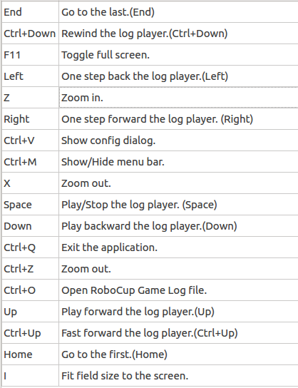

# rcg\_player

  

Log file player using RCG format, inspired from [rcsslogplayer](http://sourceforge.net/projects/sserver/files/rcsslogplayer/).

# Compiling
- Run `./build.sh` to compile

# Usages
- Run `./bin/rcg_player data/cart-pole.rcg` to view a [cart-pole](https://github.com/aijunbai/pole) log
- Run `./bin/rcg_player data/human_track.rcg` to view a [human-tracker](https://github.com/aijunbai/pfs) log

# Key Shortcuts

